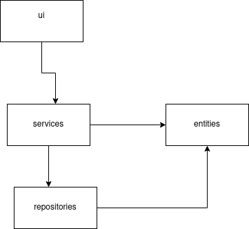
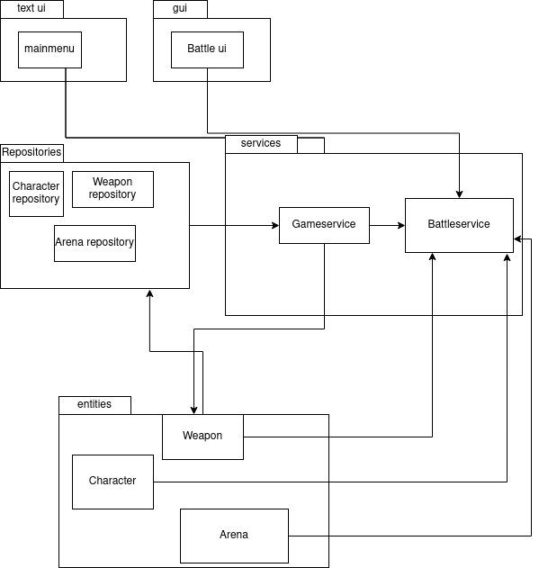
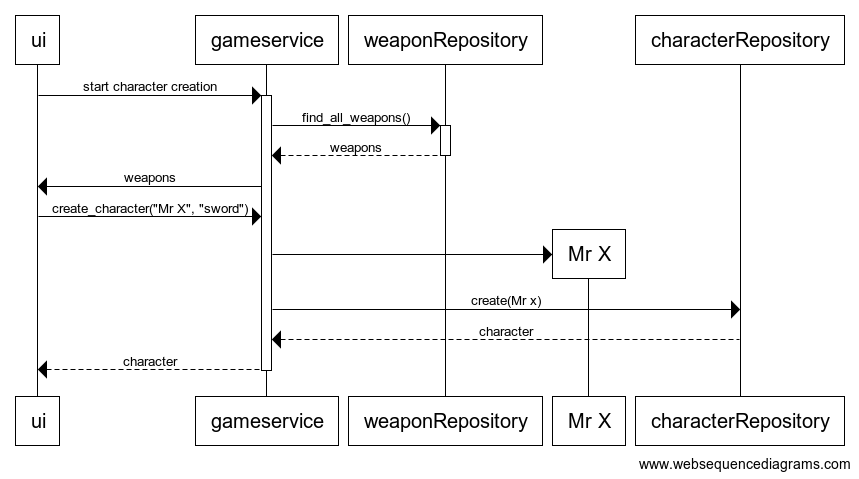

# Arkkitehtuurikuvaus

## Rakenne

Peli käyttää kerrosarkkitehtuuria, jossa ui-luokat antavat komentoja services-luokille, jotka käyttävät entities-luokkin olioita sovelluslogiikassa, ja repository-luokkia tietokannan kanssa kommunikointiin.

## Sovelluslogiikka

Eri repository-luokat huolehtivat entities-luokkien talletuksesta ja lataamisesta tietokannasta, ja syöttävät entities-luokan olioiat gameservicelle. Gameservice voi käynnistää battleservice syöttäen sille olioita, ja käynnistäen battle ui -luokan käyttöliittymän. Battleservice ja battle ui huolehtivat taistelun pyörittämisestä.

## Toiminnallisuuksia
### Hahmon luonti

